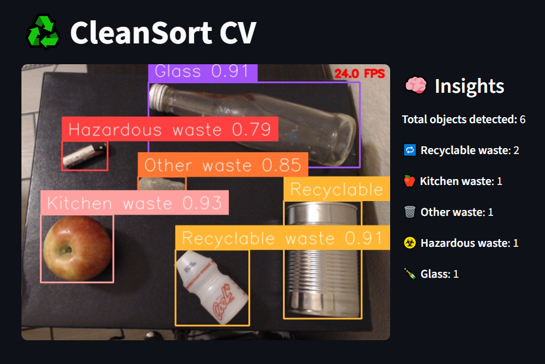
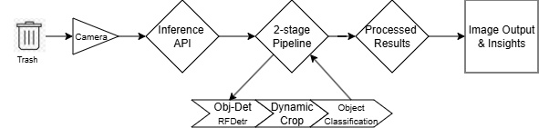

# CleanSort-CV

Smart waste sorting app powered by Streamlit and Roboflow Workflows.
It runs real-time object detection on a live camera feed, classifies waste types, and tracks counts per category with live insights.

## Tech Stack

Streamlit for UI and visualization

Roboflow Workflows for model inference

OpenCV for image handling

Python threading for smooth live updates

## Run it

pip install -r requirements.txt
streamlit run app.py
